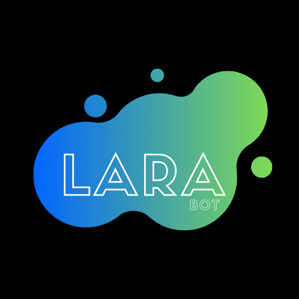

  
  

`Lara` is a [telegram](https://telegram.org/) bot written in
`TypeScript` in the [Node.js](https://nodejs.org/en/) runtime, it use the
GrammY framework.

---

## Useful Files
- [Setup](SETUP.md)
- [Contributing](CONTRIBUTING.md)
- [License](LICENSE)

---
## Contacts
- E-mail: weslley.programmer@gmail.com
- Developers group: https://t.me/joinchat/RNQAdg9_1-8wMTcx